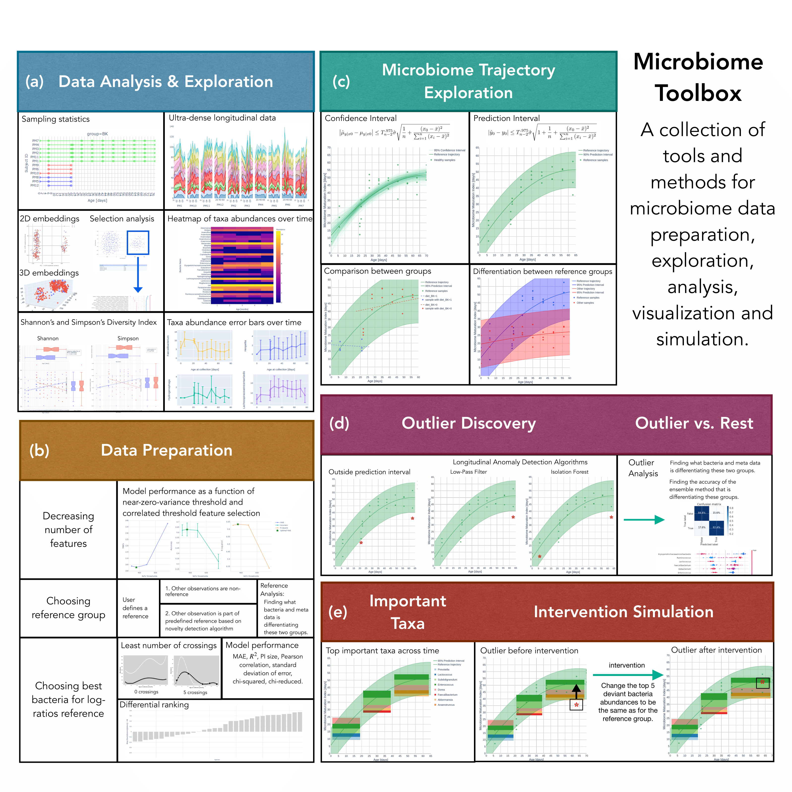

<div align="center">
  <p>
  
  </p>
  <p>
    <a href="http://www.freepik.com">
      
    </a>
  </p>
  
  <p>
    <a href="https://microbiome-toolbox.azurewebsites.net/">
      Dashboard
    </a>
  </p>
</div>

- [Dashboard](https://microbiome-toolbox.azurewebsites.net/) with interactive visualizations
- [Bioinformatics](https://academic.oup.com/bioinformatics/advance-article/doi/10.1093/bioinformatics/btac781/6873738) paper
- We are on the [curated set](https://dash-demo.plotly.host/Portal/) and [Plotly&Dash 500](https://dash-demo.plotly.host/plotly-dash-500/) of STEM focused Plotly Dash apps (as Microbiome-Toolbox)!

# Microbiome Toolbox

Microbiome toolbox is a collection of tools and methods for microbiome data and it includes data analysis and exploration, data preparation, microbiome trajectory modeling, outlier discovery and intervention. Our toolbox also encompasses most of the common machine learning algorithms that exist in different packages.

Features:
- **Data analysis and exploration of microbiota data**: analise the bacteria from a given dataset including the longitudinal analysis
- **Data preparation**: different ways of preparing data for machine learning model training to build microbiome trajectory
    - **Feature extraction**: decreasing the number of features used for building the trajectory by selecting the top important ones
    - **Reference vs. non-reference data analysis**: using different techniques to classify samples into these two groups (optional)
    - **Log-ratios data transformation**: transforming bacteria abundances to log-ratio w.r.t. the chosen bacteria
- **Microbiome trajectory**: build different microbiome trajectories with machine learning models and compare with statistical tests 
- **Anomaly detection**: detect samples that are labeled as reference but based on the bacteria analysis are actually outliers
- **Boxplot with time**: check what are top important bacteria in a reference group of samples w.r.t. time
- **Intervention simulation**: what are a few bacteria that should be modified to move the non-reference sample into reference group 



## Technical glossary

<details>
  <summary><b> Dataset </b></summary>

<table>
  <tr>
    <th>Input</th>
    <td>
      <ul>
        <li>File name</li>
        <li>Feature columns</li>
        <li>Normalization</li>
        <li>Log ratio bacteria (optional)</li>
        <li>Reference group choice (optional)</li>
        <li>Time unit</li>
      </ul>  
    </td>
  </tr>
  
  <tr>
    <th>Processing</th>
    <td>
      <ul>
        <li>The dataset is read from the user uploaded csv file or available human and mouse datasets.</li>
        <li>It consists of several samples collected at different sampling times from multiple subjects. Each sample is represented by several features, particularly bacteria values which specify proportional abundance of different microorganisms, metadata values like diet, country, etc. (optional), sample collection time, sample id, subject id, group is one of the metadata columns renamed to perform group analysis (optional, by default none), and reference group (optional, by default all samples are true, i.e., belong to the reference).</li>  
        <li>Depending on the reference group choice, the definition of reference group samples will be further tuned. Possible choices are user defined (default) which leaves the set of reference and non-reference samples unchanged, and novelty detection with local outlier factor which searches for the reference samples among non-reference samples (unlabeled samples, that were not set to true). The 2 neighbors and Bray-Curtis metric are used as novelty detection parameters. After the novelty detection, the set of reference samples is modified with increased number of reference samples. Note that it only makes sense to use the novelty detection if one specifies set of reference samples and is unsure for the rest.</li>
        <li>Differentiation score is a useful metric value indicating the level of difference between two groups. We are interested in differentiation score between reference and non-reference. Training a binary classifier on features of the samples and reference groups as a label gives us a model whose performance (F1-score) is indicator of two-groups differentiation. The higher the differentiation score, the better the model is in differentiating the two groups.</li>
        <li>Feature columns define features that the novelty detection algorithm (if selected) will use as explained abve. Supported options are bacteria columns only, metadata columns only, or both (no time variable). Note that this set of feature columns is not necessarily the same as the feature columns used for building the microbiome trajectory.</li>
        <li>The time unit is mainly used for visualization purposes.</li>
        <li>If normalization is selected, it will normalize each feature column, i.e., each column values will range from 0 to 1. It is a useful preprocessing step in cases where features vary in degrees of magnitude and range.</li>
        <li>Log ratio bacteria is used for calculating the log of the ratio between features and selected bacteria. The log ratio transformation affects the values of bacteria features only and the chosen bacteria, which was used as denominator for log ratio calculations, is removed from feature columns, since after the transformation this column contains only 1 as a value. By default, there is no log ratio bacteria selected (default is none) and proportional abundances of different microorganisms are used as provided by the user.</li>
      </ul>  
    </td>
  </tr>
  
  <tr>
    <th>Output</th>
    <td>
      <ul>
        <li>The plot of bacteria abundances or modified bacteria values if log-ratio transformation is performed</li>
        <li>The heatmap of bacteria abundance or modified bacteria values if log-ratio transformation is performed</li>
        <li>The plot of ultra-dense longitudinal data with bacteria abundances stacked w.r.t. time
Embeddings to 2D/3D space using PCA, UMAP, tSNE</li>
        <li>Two groups differentiation with confusion matrix after user selects the subset of embedded samples in the low dimensional plot</li>
      </ul>  
    </td>
  </tr>
  
  <tr>
    <th>Reference</th>
    <td>
https://github.com/JelenaBanjac/microbiome-toolbox/blob/main/microbiome/dataset.py</td>
  </tr>
</table>

</details>

<details>
  <summary><b> Trajectory </b></summary>

<table>
  <tr>
    <th>Input</th>
    <td>
      <ul>
        <li>Dataset</li>
        <li>Feature columns</li>
        <li>Feature extraction</li>
        <li>Time unit</li>
        <li>Anomaly type</li>
        <li>Train indices</li>
      </ul>  
    </td>
  </tr>
  
  <tr>
    <th>Processing</th>
    <td>
      <ul>
        <li>The machine learning algorithm called RandomForestRegressor is used to predict sampling times from microbiome composition.</li>
        <li>Cross-validation resamples data using group k-fold where k is set to 5 folds/splits and the group is subject id.</li>  
        <li>Grid search with cross-validation is used to find the optimal number of estimators for the algorithm which results in the most accurate model predictions. Tested hyperparameter values are 50, 100, and 150.</li>
        <li>Feature columns define features that the machine learning algorithm will use for training of the model and inference. Supported options are bacteria columns only, metadata columns only, or both (as provided by the user). The number of feature columns can be further decreased if the user selects one of the feature extraction techniques like near zero variance, correlation, and top K important features. The extraction technique internally runs the same machine- learning algorithm for 10 different thresholds. The features of the best-performing model are then used as the final smaller feature columns set.</li>
        <li>Only samples matching the training indices are used for model training (as provided by the user).</li>
        <li>The time unit is mainly used for visualization purposes.</li>
        <li>The last part is detecting anomalies using one of the available detection algorithms, prediction interval, low pass filter, or isolation forest which returns indices of anomalous samples. These anomaly indices are later used for visualization purpose only.</li>
        <li>Comparison of two trajectories is performed between two fitted lines or curves on the MMI data (not actual MMIs but fits), depending on polynomial degree used. Two linear lines (st degree polynomial) are compared using linear regression statistical analysis and two curves (Nth degree polynomial) are compared using longitudinal statistical analysis method (splinectomeR package).</li>
      </ul>  
    </td>
  </tr>
  
  <tr>
    <th>Output</th>
    <td>
      <ul>
        <li>The plot of the reference trajectory: one reference trajectory, scattered reference samples</li>
        <li>The plot of reference groups: two trajectories for both reference and non-reference, scattered samples</li>
        <li>The plot of groups: several microbiome trajectories depending on the groups as provided by the user (e.g., countries, diet-type etc.), scattered group samples</li>
        <li>The plot of anomalies: reference microbiome trajectory, scattered reference samples, highlighted anomalous samples</li>
        <li>The plot of time boxes: reference microbiome trajectory, scattered reference samples, timeboxes with specified time block ranges (excluding the anomalous samples) and within time-box feature relative-importance</li>
        <li>The plot of the intervention simulation: reference microbiome trajectory, timeboxes, and intervention with specified time block ranges (excluding the anomalous samples) and within time-box feature relative-importance</li>
        <li>The plot of longitudinal sample information: reference microbiome trajectory with a confidence interval, longitudinal samples per subject</li>
        <li>The plot of feature extraction techniques with 10 different thresholds performance summary (if feature extraction is selected in input)</li>
      </ul>  
    </td>
  </tr>
  
  <tr>
    <th>Reference</th>
    <td>
https://github.com/JelenaBanjac/microbiome-toolbox/blob/main/microbiome/trajectory.py</td>
  </tr>
</table>

</details>

## Installation
The microbiome toolbox has a [PyPi package](https://pypi.org/project/microbiome-toolbox/) available.

```bash
# create environment
conda env create -f environment.yml

# activate environment
conda activate microbiome

# install microbiome toolbox
pip install microbiome-toolbox --user
```

## Run dashboard locally (on your computer)
After you successfully installed the microbiome-toolbox and activated the environment, just execute the following commands:

```bash
# set up the development environment (on Linux)
source webapp/environment/.evv.development

# run the server
python webapp/index.py
```
The only step that differs for Windows is that you should modify the environment variables with values indicated in file `webapp/environment/.evv.development`. 
After that, you can run the server on Windows.

## Examples

For the toolbox usage, checkout the notebooks:
- [1. Mouse dataset](https://nbviewer.org/github/JelenaBanjac/microbiome-toolbox/tree/main/notebooks/Mouse_16S/microbiome_dataset.ipynb)
- [2. Mouse trajectory](https://nbviewer.org/github/JelenaBanjac/microbiome-toolbox/blob/main/notebooks/Mouse_16S/microbiome_trajectory.ipynb)
- [3. Human infants dataset](https://nbviewer.org/github/JelenaBanjac/microbiome-toolbox/tree/main/notebooks/Human_Subramanian/microbiome_dataset.ipynb)
- [4. Human infants trajectory](https://nbviewer.org/github/JelenaBanjac/microbiome-toolbox/blob/main/notebooks/Human_Subramanian/microbiome_trajectory.ipynb)

## Issues
If you notice any issues, please report them at [Github issues](https://github.com/JelenaBanjac/microbiome-toolbox/issues).

## Licence 
The project is licensed under the [MIT license](./LICENCE).

## Authors
[Jelena Banjac](https://jelenabanjac.com/), [Shaillay Kumar Dogra](ShaillayKumar.Dogra@rd.nestle.com), [Norbert Sprenger](norbert.sprenger@rdls.nestle.com)

## Citation
The code in this repository is released under the terms of the [MIT license](./LICENCE.md). Please cite our paper if you use it.

BibTeX citation style:
```
@article{10.1093/bioinformatics/btac781,
    author = {Banjac, Jelena and Sprenger, Norbert and Dogra, Shaillay Kumar},
    title = "{Microbiome Toolbox: methodological approaches to derive and visualize microbiome trajectories}",
    journal = {Bioinformatics},
    volume = {39},
    number = {1},
    year = {2022},
    month = {12},
    abstract = "{The gut microbiome changes rapidly under the influence of different factors such as age, dietary changes or medications to name just a few. To analyze and understand such changes, we present a Microbiome Toolbox. We implemented several methods for analysis and exploration to provide interactive visualizations for easy comprehension and reporting of longitudinal microbiome data.Based on the abundance of microbiome features such as taxa as well as functional capacity modules, and with the corresponding metadata per sample, the Microbiome Toolbox includes methods for (i) data analysis and exploration, (ii) data preparation including dataset-specific preprocessing and transformation, (iii) best feature selection for log-ratio denominators, (iv) two-group analysis, (v) microbiome trajectory prediction with feature importance over time, (vi) spline and linear regression statistical analysis for testing universality across different groups and differentiation of two trajectories, (vii) longitudinal anomaly detection on the microbiome trajectory and (viii) simulated intervention to return anomaly back to a reference trajectory.The software tools are open source and implemented in Python. For developers interested in additional functionality of the Microbiome Toolbox, it is modular allowing for further extension with custom methods and analysis. The code, python package and the link to the interactive dashboard of Microbiome Toolbox are available on GitHub https://github.com/JelenaBanjac/microbiome-toolboxSupplementary data are available at Bioinformatics online.}",
    issn = {1367-4811},
    doi = {10.1093/bioinformatics/btac781},
    url = {https://doi.org/10.1093/bioinformatics/btac781},
    note = {btac781},
    eprint = {https://academic.oup.com/bioinformatics/article-pdf/39/1/btac781/48520839/btac781.pdf},
}

```
APA citation style:
```
Jelena Banjac, Norbert Sprenger, Shaillay Kumar Dogra, Microbiome Toolbox: methodological approaches to derive and visualize microbiome trajectories, Bioinformatics, Volume 39, Issue 1, January 2023, btac781, https://doi.org/10.1093/bioinformatics/btac781
```
